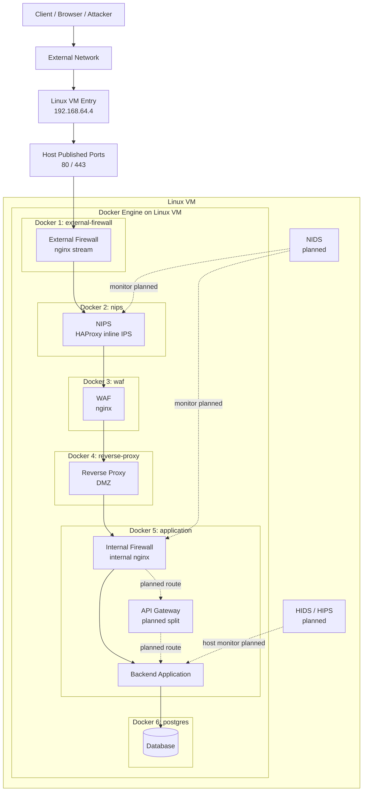

# Current Architecture

このドキュメントは、現在の Docker 実装が Linux VM 上でどう並んでいるかと、まだ未実装だが今後想定している層を 1 枚で確認するためのものです。

## 全体構成



## この図の読み方

- `Linux VM Entry 192.168.64.4`
  - VM 自体の入口です
  - 外部からの通信はまずこの IP に到達します
- `Host Published Ports 80 / 443`
  - Docker がホスト側で公開しているポートです
  - 今は `external-firewall` だけがホスト公開されています
- `Docker 1` から `Docker 6`
  - 1 台の VM の中で、別サーバ相当の役割を Docker コンテナで分離しています

## 入口として外部公開されているのはどこか

外部から見える入口は `Docker 1: external-firewall` だけです。  
今回の Compose では、ホスト側に `ports` を持っているのはこのコンテナだけであり、公開されているのは `80/443` のみです。

つまり外部クライアントから到達できるのは次だけです。

- `192.168.64.4:80`
- `192.168.64.4:443`

`nips`, `waf`, `reverse-proxy`, `application`, `postgres` は Docker 内部ネットワーク上のノードであり、外部から直接到達させる設計にはしていません。

## Docker 2 と Docker 3 は公開されているのか

結論から言うと、`Docker 2: nips` と `Docker 3: waf` は「存在している」が、「外部に公開している」わけではありません。

ここで重要なのは、`別コンテナとして存在すること` と `外部から直接アクセスできること` は同じではない、という点です。

- `external-firewall`
  - `ports` を持つ
  - ホスト側で `80/443` を公開する
- `nips`
  - `ports` を持たない
  - Docker 内部ネットワークでのみ到達
- `waf`
  - `ports` を持たない
  - Docker 内部ネットワークでのみ到達

したがって、`nips` や `waf` の Docker 内部 IP を知ったとしても、通常は VM 外部からその IP へ直接到達できません。  
今回の意味で重要なのは、`パブリックIP / プライベートIP` という言い方そのものより、`ホスト公開されている到達点` と `Docker 内部だけで到達できる到達点` を分けて考えることです。

## Docker 1 から Docker 2, 3 にどう渡しているか

`Docker 1` は `WAF` に直接渡しているのではなく、まず `NIPS` に渡し、その後 `NIPS` が `WAF` に渡しています。

現在の本線は次です。

```text
Client
  -> 192.168.64.4:80/443
  -> external-firewall
  -> nips
  -> waf
  -> reverse-proxy
  -> application
  -> postgres
```

受け渡しは Docker の内部ネットワーク上のサービス名で行っています。

- `external-firewall`
  - `nips:80`, `nips:443` に TCP 転送
- `nips`
  - `waf:80`, `waf:443` に転送
- `waf`
  - `reverse-proxy:80` に転送

つまり、ホスト公開ポートで後段を露出しているのではなく、Docker 内部 DNS による名前解決と内部ネットワーク通信で直列中継しています。

## 現在実装されている流れ

現在、実際に通信本線として動いているのは次です。

```text
Client
  -> Linux VM Entry (192.168.64.4)
  -> Host published ports 80/443
  -> external-firewall
  -> nips
  -> waf
  -> reverse-proxy
  -> application internal nginx
  -> backend application
  -> postgres
```

各層の実装は次の通りです。

- `Docker 1: external-firewall`
  - `nginx stream`
  - ホストから見える唯一の公開入口
- `Docker 2: nips`
  - `HAProxy`
  - rate 制御、接続数監視、TLS ClientHello 妥当性確認
- `Docker 3: waf`
  - `nginx`
  - HTTP メソッド、危険 UA、危険 path/query の検査
- `Docker 4: reverse-proxy`
  - `nginx`
  - DMZ 公開サーバ相当
- `Docker 5: application`
  - internal nginx と backend をまとめている段階
  - 現時点では `Internal Firewall` と `Backend` を同一コンテナで再現
- `Docker 6: postgres`
  - `PostgreSQL`
  - 最深部のデータ層

## まだ未実装だが想定しているもの

- `API Gateway`
  - 現在は `application` コンテナ内に未分離
  - 将来的には独立コンテナ化して、認証認可や API 単位の制御を分離する
- `NIDS`
  - 本線上ではなく、監視専用として横から観測する想定
- `HIDS / HIPS`
  - backend ホスト相当の監視・保護として追加する想定

## Docker に依存している部分

この構成で Docker が担っているのは、機能そのものではなく分離の再現です。

- `NIPS` の防御ロジック
  - `HAProxy` 設定で実装
- `WAF` の防御ロジック
  - `nginx` 設定で実装
- それらを別サーバのように並べること
  - Docker Compose と Docker ネットワークで再現

つまり、`NIPS` や `WAF` という概念自体が Docker 依存なのではなく、今回の単一 VM 上の学習・検証環境が Docker を使っている、という整理になります。

## 本来の別サーバ構成とどこまで噛み合っているか

この構成は、本来 `External Firewall`, `NIPS`, `WAF`, `Reverse Proxy`, `Application`, `Database` が別々のサーバや別ネットワーク境界に置かれる設計を、1 台の Linux VM 上で擬似的に再現したものです。

噛み合っている部分は次です。

- 役割ごとに層を分離している
- 外部公開する層を `external-firewall` に限定している
- 通信経路を `external-firewall -> nips -> waf -> reverse-proxy -> application -> postgres` に段階化している
- 「どこで止めるか」「どこから内側か」を説明できる

一方で、完全には一致しない部分もあります。

- 全コンテナは同じ Linux VM 上にある
- Docker Engine とホスト OS を共有している
- 物理 NIC、VLAN、別ホスト間ルーティングまでは再現していない
- ホスト侵害時には内部コンテナへの到達余地が残る

したがって、今回の構成は `設計思想の再現としては噛み合っている` が、`物理的・運用的な完全分離を再現しているわけではない` と説明するのが正確です。

## どこまでを脆弱性と考えるべきか

`nips` や `waf` が別コンテナで存在すること自体は、直ちに脆弱性を意味しません。  
重要なのは、それらが外部へ直接公開されているかどうかです。

現状の構成では、

- 外部公開
  - `external-firewall` の `80/443` のみ
- 内部限定
  - `nips`
  - `waf`
  - `reverse-proxy`
  - `application`
  - `postgres`

です。

ただし、次のような場合はリスクになります。

- 誤って `nips` や `waf` に `ports` を追加した場合
- ホスト側の firewall や routing を誤設定した場合
- Linux VM 自体が侵害された場合

つまり、今回の安全性は `Docker で分けたから自動的に安全` なのではなく、`公開ポートを入口だけに限定し、後段を内部ネットワークに閉じ込めている` ことによって成立しています。

## 報告書で強調すべき整理

報告書では次のように整理すると誤解が少なくなります。

1. 本来は別サーバで構成される各層を、1 台の Linux VM 上で Docker コンテナとして擬似再現している。
2. 外部から直接到達できるのは VM の IP `192.168.64.4` 上で公開された `80/443` のみであり、その受け口は `external-firewall` だけである。
3. `nips` と `waf` は独立した防御ノードとして存在するが、Docker 内部ネットワーク上の内部中継点であり、外部へ直接公開していない。
4. `external-firewall` は Docker 内部 DNS を使って `nips` へ渡し、`nips` は `waf` へ、`waf` は `reverse-proxy` へ順に転送する。
5. このため、設計思想としては多サーバ分離に噛み合っているが、物理的な完全分離ではなく、あくまで単一 VM 上の論理分離である。

## 報告書向けの要点

報告書では、次のように説明できます。

今回の環境では、本来別サーバとして分離されるべき `External Firewall`, `NIPS`, `WAF`, `Reverse Proxy`, `Application`, `Database` を、1 台の Linux VM 上で Docker コンテナとして直列配置することで擬似再現している。外部通信はまず VM の IP `192.168.64.4` に到達し、ホスト公開ポート `80/443` を経由して `external-firewall` に入り、その後 `nips`, `waf`, `reverse-proxy`, `application`, `postgres` へ順に流れる。未実装の `API Gateway`, `NIDS`, `HIDS/HIPS` は今後の拡張対象として位置づけている。
