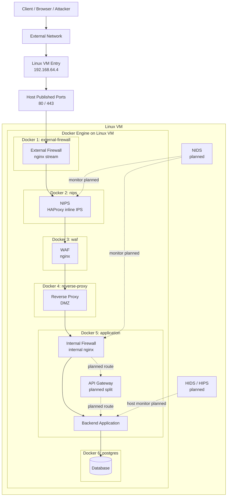

# Current Architecture

このドキュメントは、現在の Docker 実装が Linux VM 上でどう並んでいるかと、まだ未実装だが今後想定している層を 1 枚で確認するためのものです。

## 全体構成



## この図の読み方

- `Linux VM Entry 192.168.64.4`
  - VM 自体の入口です
  - 外部からの通信はまずこの IP に到達します
- `Host Published Ports 80 / 443`
  - Docker がホスト側で公開しているポートです
  - 今は `external-firewall` だけがホスト公開されています
- `Docker 1` から `Docker 6`
  - 1 台の VM の中で、別サーバ相当の役割を Docker コンテナで分離しています

## 現在実装されている流れ

現在、実際に通信本線として動いているのは次です。

```text
Client
  -> Linux VM Entry (192.168.64.4)
  -> Host published ports 80/443
  -> external-firewall
  -> nips
  -> waf
  -> reverse-proxy
  -> application internal nginx
  -> backend application
  -> postgres
```

各層の実装は次の通りです。

- `Docker 1: external-firewall`
  - `nginx stream`
  - ホストから見える唯一の公開入口
- `Docker 2: nips`
  - `HAProxy`
  - rate 制御、接続数監視、TLS ClientHello 妥当性確認
- `Docker 3: waf`
  - `nginx`
  - HTTP メソッド、危険 UA、危険 path/query の検査
- `Docker 4: reverse-proxy`
  - `nginx`
  - DMZ 公開サーバ相当
- `Docker 5: application`
  - internal nginx と backend をまとめている段階
  - 現時点では `Internal Firewall` と `Backend` を同一コンテナで再現
- `Docker 6: postgres`
  - `PostgreSQL`
  - 最深部のデータ層

## まだ未実装だが想定しているもの

- `API Gateway`
  - 現在は `application` コンテナ内に未分離
  - 将来的には独立コンテナ化して、認証認可や API 単位の制御を分離する
- `NIDS`
  - 本線上ではなく、監視専用として横から観測する想定
- `HIDS / HIPS`
  - backend ホスト相当の監視・保護として追加する想定

## Docker に依存している部分

この構成で Docker が担っているのは、機能そのものではなく分離の再現です。

- `NIPS` の防御ロジック
  - `HAProxy` 設定で実装
- `WAF` の防御ロジック
  - `nginx` 設定で実装
- それらを別サーバのように並べること
  - Docker Compose と Docker ネットワークで再現

つまり、`NIPS` や `WAF` という概念自体が Docker 依存なのではなく、今回の単一 VM 上の学習・検証環境が Docker を使っている、という整理になります。

## 報告書向けの要点

報告書では、次のように説明できます。

今回の環境では、本来別サーバとして分離されるべき `External Firewall`, `NIPS`, `WAF`, `Reverse Proxy`, `Application`, `Database` を、1 台の Linux VM 上で Docker コンテナとして直列配置することで擬似再現している。外部通信はまず VM の IP `192.168.64.4` に到達し、ホスト公開ポート `80/443` を経由して `external-firewall` に入り、その後 `nips`, `waf`, `reverse-proxy`, `application`, `postgres` へ順に流れる。未実装の `API Gateway`, `NIDS`, `HIDS/HIPS` は今後の拡張対象として位置づけている。
