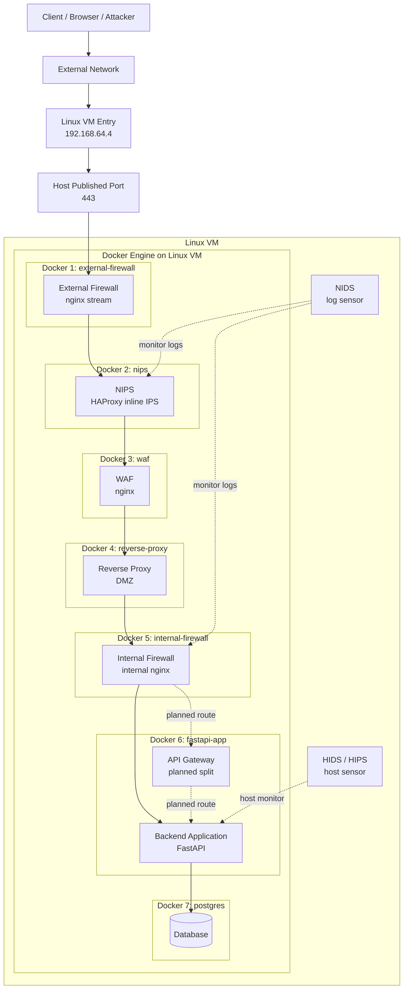

# Current Architecture

このドキュメントは、現在の Docker 実装が Linux VM 上でどう並んでいるかと、まだ未実装だが今後想定している層を 1 枚で確認するためのものです。

## 全体構成



## この図の読み方

- `Linux VM Entry 192.168.64.4`
  - VM 自体の入口です
  - 外部からの通信はまずこの IP に到達します
- `Host Published Port 443`
  - Docker がホスト側で公開しているポートです
  - 今は `external-firewall` だけがホスト公開されています
- `Docker 1` から `Docker 7`
  - 1 台の VM の中で、別サーバ相当の役割を Docker コンテナで分離しています

## 入口として外部公開されているのはどこか

外部から見える入口は `Docker 1: external-firewall` だけです。  
今回の Compose では、ホスト側に `ports` を持っているのはこのコンテナだけであり、公開されているのはHTTPS用の`443`のみです。

つまり外部クライアントから到達できるのは次だけです。

- `192.168.64.4:443`

`nips`, `waf`, `reverse-proxy`, `internal-firewall`, `fastapi-app`, `postgres` は Docker 内部ネットワーク上のノードであり、外部から直接到達させる設計にはしていません。

## Docker 2 と Docker 3 は公開されているのか

結論から言うと、`Docker 2: nips` と `Docker 3: waf` は「存在している」が、「外部に公開している」わけではありません。

ここで重要なのは、`別コンテナとして存在すること` と `外部から直接アクセスできること` は同じではない、という点です。

- `external-firewall`
  - `ports` を持つ
  - ホスト側でHTTPS用の`443`だけを公開する
- `nips`
  - `ports` を持たない
  - Docker 内部ネットワークでのみ到達
- `waf`
  - `ports` を持たない
  - Docker 内部ネットワークでのみ到達

したがって、`nips` や `waf` の Docker 内部 IP を知ったとしても、通常は VM 外部からその IP へ直接到達できません。  
今回の意味で重要なのは、`パブリックIP / プライベートIP` という言い方そのものより、`ホスト公開されている到達点` と `Docker 内部だけで到達できる到達点` を分けて考えることです。

## Docker 1 から Docker 2, 3 にどう渡しているか

`Docker 1` は `WAF` に直接渡しているのではなく、まず `NIPS` に渡し、その後 `NIPS` が `WAF` に渡しています。

現在の本線は次です。

```text
Client
  -> 192.168.64.4:443
  -> external-firewall
  -> nips
  -> waf
  -> reverse-proxy
  -> internal-firewall
  -> fastapi-app
  -> postgres
```

受け渡しは Docker の内部ネットワーク上のサービス名で行っています。

- `external-firewall`
  - `nips:80`, `nips:443` に TCP 転送
- `nips`
  - `waf:80`, `waf:443` に転送
- `waf`
  - `reverse-proxy:80` に転送

つまり、ホスト公開ポートで後段を露出しているのではなく、Docker 内部 DNS による名前解決と内部ネットワーク通信で直列中継しています。

## 現在実装されている流れ

現在、実際に通信本線として動いているのは次です。

```text
Client
  -> Linux VM Entry (192.168.64.4)
  -> Host published port 443
  -> external-firewall
  -> nips
  -> waf
  -> reverse-proxy
  -> internal-firewall
  -> fastapi-app
  -> postgres
```

各層の実装は次の通りです。

- `Docker 1: external-firewall`
  - `nginx stream`
  - ホストから見える唯一の公開入口
- `Docker 2: nips`
  - `HAProxy`
  - rate 制御、接続数監視、TLS ClientHello 妥当性確認
- `Docker 3: waf`
  - `nginx`
  - HTTP メソッド、危険 UA、危険 path/query の検査
- `Docker 4: reverse-proxy`
  - `nginx`
  - DMZ 公開サーバ相当
- `Docker 5: internal-firewall`
  - internal nginx
  - `Reverse Proxy` 後段で `/api/` だけを FastAPI に流す
- `Docker 6: fastapi-app`
  - FastAPI
  - 商品 API、認証 API、JWT、出品者プロフィール API
  - PostgreSQL 依存を持つ内部 API
- `Docker 7: postgres`
  - `PostgreSQL`
  - 商品、認証、出品者プロフィール、監査イベントを持つ最深部のデータ層

## まだ未実装だが想定しているもの

- `API Gateway`
  - 現在は `fastapi-app` の前段に未分離
  - 将来的には独立コンテナ化して、認証認可や API 単位の制御を分離する
- `NIDS`
  - 本線上ではなく、監視専用として横からログを観測する
  - `nids` コンテナが external firewall / WAF / reverse proxy / internal firewall のログを読み、`logs/nids/alerts.log` にアラートを残す
- `HIDS / HIPS`
  - `fastapi-app` ホスト相当の監視・保護として追加する
  - `hids-hips` コンテナが FastAPI ソースの改ざん検知と内部ヘルスチェックを行い、`logs/hids/alerts.log` にアラートを残す

## Docker に依存している部分

この構成で Docker が担っているのは、機能そのものではなく分離の再現です。

- `NIPS` の防御ロジック
  - `HAProxy` 設定で実装
- `WAF` の防御ロジック
  - `nginx` 設定で実装
- それらを別サーバのように並べること
  - Docker Compose と Docker ネットワークで再現

つまり、`NIPS` や `WAF` という概念自体が Docker 依存なのではなく、今回の単一 VM 上の学習・検証環境が Docker を使っている、という整理になります。

## 本来の別サーバ構成とどこまで噛み合っているか

この構成は、本来 `External Firewall`, `NIPS`, `WAF`, `Reverse Proxy`, `Internal Firewall`, `Backend Application`, `Database` が別々のサーバや別ネットワーク境界に置かれる設計を、1 台の Linux VM 上で擬似的に再現したものです。

噛み合っている部分は次です。

- 役割ごとに層を分離している
- 外部公開する層を `external-firewall` に限定している
- 通信経路を `external-firewall -> nips -> waf -> reverse-proxy -> internal-firewall -> fastapi-app -> postgres` に段階化している
- 「どこで止めるか」「どこから内側か」を説明できる

一方で、完全には一致しない部分もあります。

- 全コンテナは同じ Linux VM 上にある
- Docker Engine とホスト OS を共有している
- 物理 NIC、VLAN、別ホスト間ルーティングまでは再現していない
- ホスト侵害時には内部コンテナへの到達余地が残る

したがって、今回の構成は `設計思想の再現としては噛み合っている` が、`物理的・運用的な完全分離を再現しているわけではない` と説明するのが正確です。

## 実際の物理構成ではどうするのが一般的か

実運用で多層防御を組む場合は、単に役割ごとにソフトウェアを分けるだけでなく、ネットワーク自体も段階的に分離するのが一般的です。

### 1. 役割ごとにサーバまたは VM を分ける

まず、次のように役割単位でホストを分けることが多いです。

- 外部公開入口
  - External Firewall
  - Reverse Proxy
  - 場合によっては WAF
- 境界防御
  - NIPS
  - NIDS
- 業務処理
  - API Gateway
  - Backend Application
- データ層
  - Database

つまり本番では、今回の Docker 1 から Docker 7 に相当するものを、別々の物理サーバ、別 VM、または別ノード上に配置することが一般的です。

### 2. NIC を複数持たせて境界を分ける

物理サーバや仮想サーバでは、用途に応じて NIC を分ける構成がよく使われます。

例:

- NIC1
  - 外部向け
  - Internet / WAN / 公開セグメント接続
- NIC2
  - DMZ 向け
  - Reverse Proxy や WAF と接続
- NIC3
  - 内部アプリ向け
  - Application Zone と接続
- NIC4
  - DB 向け
  - Database 専用セグメント

すべてのサーバが必ず複数 NIC を持つわけではありませんが、少なくとも「外側」と「内側」を別インターフェースまたは別セグメントに分ける考え方は一般的です。

### 3. VLAN で論理的にセグメントを分離する

物理的にスイッチを完全分離しない場合でも、VLAN を切ってセグメントを分けることが一般的です。

例:

- VLAN 10
  - DMZ
- VLAN 20
  - Application Zone
- VLAN 30
  - Database Zone
- VLAN 40
  - Management / Monitoring

これにより、同じ物理スイッチ基盤を使っていても、L2 レベルで通信範囲を分離できます。  
今回の `edge_net`, `app_net`, `db_net` は、この VLAN 分離を学習用に単純化して再現していると考えると分かりやすいです。

### 4. ルータや Firewall でセグメント間ルーティングを制御する

実運用では、各 VLAN や各ネットワークの間を自由に通すのではなく、Firewall や L3 機器で通信経路を制御します。

例えば次のような制限をかけます。

- Internet -> DMZ
  - HTTPS用の`443`のみ許可
- DMZ -> App
  - Reverse Proxy から App の必要ポートだけ許可
- App -> DB
  - Backend から DB の必要ポートだけ許可
- App / DB -> Internet
  - 原則禁止または最小限
- Monitoring -> 各層
  - 監視用ポートのみ許可

つまり、単に「サーバが分かれている」だけではなく、「どのセグメントからどのセグメントへ、どのポートで行けるか」を別ホスト間ルーティングと ACL で制御するのが一般的です。

### 5. 管理系ネットワークを分けることも多い

本番では、業務通信とは別に管理用ネットワークを持つことも多いです。

例:

- SSH / RDP / Bastion 接続
- 監視エージェント通信
- ログ転送
- バックアップ通信

これにより、公開通信経路と管理経路を分離し、運用時のリスクを下げます。

### 6. 今回の Docker 構成との対応づけ

今回の Docker 構成を実環境へ対応づけると、概ね次のように読めます。

- `external-firewall`
  - 公開セグメントまたは DMZ 入口
- `nips`
  - DMZ 境界の inline 防御装置
- `waf`
  - DMZ 内または edge 側の Web 防御装置
- `reverse-proxy`
  - DMZ 公開サーバ
- `internal-firewall`
  - 内部境界
- `fastapi-app`
  - 商品 API、認証 API、出品者プロフィール API を持つ内部 API
- `postgres`
  - DB 専用セグメント
  - `products`, `users`, `seller_profiles`, `audit_events` を保持する

Docker の `edge_net`, `app_net`, `db_net` は、本物のインフラで言えば VLAN や内部 LAN セグメントに相当し、Docker のサービス間転送は、本物のインフラで言えば内部 IP 宛てのルーティングや firewall policy に相当します。

### 7. 今回再現していないもの

今回の学習用構成では、次は簡略化しています。

- 物理スイッチや配線
- VLAN タグ付け
- 複数 NIC の実装
- ルータ / L3 スイッチの経路制御
- セグメント間 ACL の専用機器実装
- 管理ネットワークの独立

そのため、今回の構成は「通信経路と責務分離の考え方」を学ぶには十分ですが、「本番ネットワーク機器の設計や配線そのもの」までは再現していない、と説明するのが適切です。

## どこまでを脆弱性と考えるべきか

`nips` や `waf` が別コンテナで存在すること自体は、直ちに脆弱性を意味しません。  
重要なのは、それらが外部へ直接公開されているかどうかです。

現状の構成では、

- 外部公開
  - `external-firewall` の `443`のみ
- 内部限定
  - `nips`
  - `waf`
  - `reverse-proxy`
  - `internal-firewall`
  - `fastapi-app`
  - `postgres`

です。

ただし、次のような場合はリスクになります。

- 誤って `nips` や `waf` に `ports` を追加した場合
- ホスト側の firewall や routing を誤設定した場合
- Linux VM 自体が侵害された場合

つまり、今回の安全性は `Docker で分けたから自動的に安全` なのではなく、`公開ポートを入口だけに限定し、後段を内部ネットワークに閉じ込めている` ことによって成立しています。

## 報告書で強調すべき整理

報告書では次のように整理すると誤解が少なくなります。

1. 本来は別サーバで構成される各層を、1 台の Linux VM 上で Docker コンテナとして擬似再現している。
2. 外部から直接到達できるのは VM の IP `192.168.64.4` 上で公開されたHTTPS用の`443`のみであり、その受け口は `external-firewall` だけである。
3. `nips` と `waf` は独立した防御ノードとして存在するが、Docker 内部ネットワーク上の内部中継点であり、外部へ直接公開していない。
4. `external-firewall` は Docker 内部 DNS を使って `nips` へ渡し、`nips` は `waf` へ、`waf` は `reverse-proxy` へ順に転送する。
5. このため、設計思想としては多サーバ分離に噛み合っているが、物理的な完全分離ではなく、あくまで単一 VM 上の論理分離である。

## 報告書向けの要点

報告書では、次のように説明できます。

今回の環境では、本来別サーバとして分離されるべき `External Firewall`, `NIPS`, `WAF`, `Reverse Proxy`, `Internal Firewall`, `Backend Application`, `Database` を、1 台の Linux VM 上で Docker コンテナとして直列配置することで擬似再現している。外部通信はまず VM の IP `192.168.64.4` に到達し、ホスト公開ポート `443` を経由して `external-firewall` に入り、その後 `nips`, `waf`, `reverse-proxy`, `internal-firewall`, `fastapi-app`, `postgres` へ順に流れる。現在の FastAPI は商品 API、認証 API、JWT、出品者プロフィール API を持ち、PostgreSQL には `products`, `users`, `seller_profiles`, `audit_events` を保持している。未実装の `API Gateway`, `NIDS`, `HIDS/HIPS` は今後の拡張対象として位置づけている。
