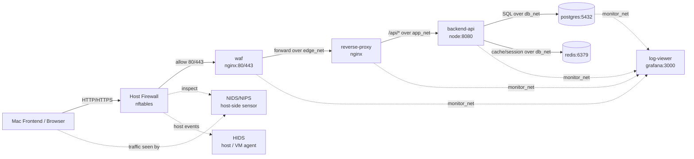
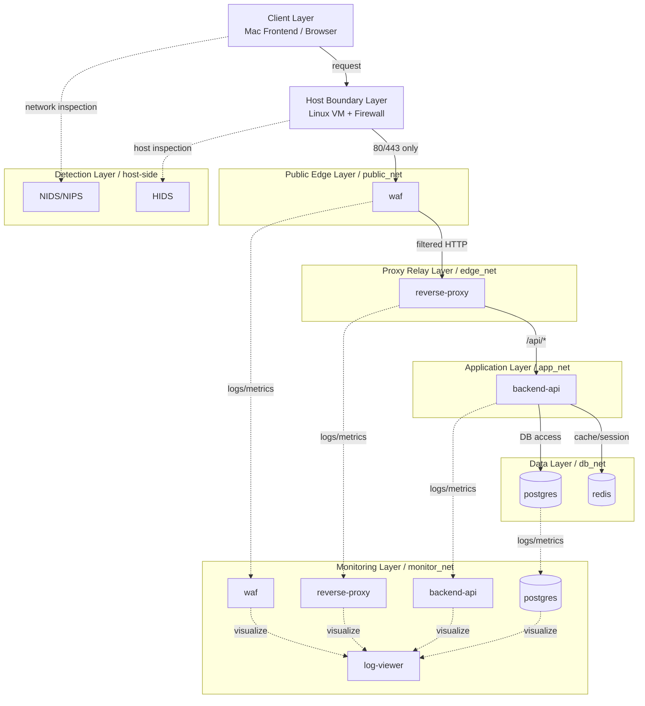

# Security EC Base Infrastructure

Linux VM 上に、Mac からアクセスする前提のバックエンド基盤です。現時点では、Host Firewall, WAF, reverse proxy, backend, data layer の分離と、監視系を別レイヤーに逃がす構成までをベースとして用意しています。

## このディレクトリで作ったもの

- `docker-compose.yml`
  - `waf`, `reverse-proxy`, `backend-api`, `postgres`, `redis`, `log-viewer` の最小構成
  - `public_net`, `edge_net`, `app_net`, `db_net`, `monitor_net` を分離
- `waf/`
  - 外部公開の最前段に置く簡易 WAF レイヤー
  - 明らかなスキャンや不正パターンを早い段階で拒否
- `nginx/`
  - WAF の後段で受ける reverse proxy
  - `/api/...` のみを backend に転送
- `backend/`
  - 疎通確認用の最小 Node.js API
  - `/health`, `/api/info` を返す
- `host-firewall/`
  - Linux VM ホスト側で適用する Rust 製 firewall CLI
  - 許可 TCP port のホワイトリストに特化した L3/L4 packet filter
- `firewall-lab/`
  - Rust 製の TCP プローブ
  - Firewall が L3/L4 でポート遮断できているかの確認用
- `nids-hids/`
  - NIDS/NIPS と HIDS をどこに置くかの整理メモ
- `logs/`
  - waf / nginx / backend / postgres のログ保存先

## 設計意図

Frontend は Mac 側で実行し、Linux VM 上にはサーバー系のみを置く前提です。そのため、外部公開対象は `waf` のみで、`reverse-proxy`, `backend-api`, `postgres`, `redis` を直接公開しない構成にしています。

想定経路:

```text
[Mac Frontend / Browser]
        |
        v
[Host Firewall on Linux VM]
   |
   v
[waf]
   |
   v
[reverse-proxy]
   |
   v
[backend-api]
   |
   v
[postgres / redis]
```

`NIDS/NIPS` と `HIDS` はこの直列経路に挟むのではなく、ホスト境界や VM 自体を監視する別レイヤーとして追加する前提です。

## 通信経路とサービス関係

Mermaid で表すと、現時点の通信経路は次のようになります。



ポイント:

- 外部から入れるのは `waf` の `80/443` だけ
- `reverse-proxy` は `edge_net` 経由で `waf` からのみ到達する前提
- `backend-api` は `app_net` 経由で `reverse-proxy` からのみ到達する前提
- `postgres` と `redis` は `db_net` 上に閉じ、`backend-api` からのみ利用する前提
- `NIDS/NIPS` と `HIDS` は通信本線の直列部品ではなく、別レイヤーの監視担当
- `log-viewer` は通常の業務通信経路には入らず、`monitor_net` 側の監視・可視化用の足場

## ネットワークレイヤーごとの動き

レイヤーごとに分けると、どの通信がどこで止まり、どこから先に進めるかは次のようになります。



各レイヤーの見え方:

- Client Layer
  - Mac 側の frontend や browser が HTTP/HTTPS リクエストを送る
- Host Boundary Layer
  - Linux VM の Firewall が公開ポートを絞り、Docker に入る前の入口制御になる
- Public Edge Layer
  - `waf` だけが外部公開され、リクエストの最初の受け口になる
- Proxy Relay Layer
  - `reverse-proxy` が WAF の後段でルーティングだけを担当する
- Application Layer
  - `backend-api` が業務 API を処理するが、外部から直接は見えない
- Data Layer
  - `postgres` と `redis` が内部データ処理だけを担当し、外部とは直接つながらない
- Monitoring Layer
  - 監視、ログ収集、可視化のための別レイヤーで、本線の API 通信とは分離して拡張する
- Detection Layer
  - `NIDS/NIPS` と `HIDS` が通信経路の横で監視し、直列には入らない

この構成により、外部からの通信は Host Firewall を通過した後に `public_net` の `waf` で受け、必要なものだけを `edge_net`, `app_net`, `db_net` と段階的に進める構造になります。

## ネットワーク構成

### `public_net`

- 役割: 外部入口
- 所属: `waf`
- 特徴: VM 外から見えるレイヤー

### `edge_net`

- 役割: WAF と reverse proxy の中継
- 所属: `waf`, `reverse-proxy`
- 特徴: `internal: true`

### `app_net`

- 役割: proxy と backend の中継
- 所属: `reverse-proxy`, `backend-api`
- 特徴: `internal: true`

### `db_net`

- 役割: backend と DB/Redis の接続
- 所属: `backend-api`, `postgres`, `redis`
- 特徴: `internal: true`

### `monitor_net`

- 役割: 監視、ログ収集、可視化の追加先
- 所属: `reverse-proxy`, `backend-api`, `postgres`, `log-viewer`
- 特徴: `internal: true`

`internal: true` のネットワークは Docker ホスト外から直接到達できません。これにより、`reverse-proxy`, `backend-api`, `postgres`, `redis` は外部から直接叩けない前提になります。

## 防御レイヤーの役割

### `Host Firewall`

- 役割:
  - VM ホストの入口で `22`, `80`, `443` のみに制限する
  - Docker に入る前に不要通信を落とす
- 実装場所:
  - `host-firewall/src/main.rs`

### `waf`

- イメージ: `nginx:1.27-alpine`
- 公開ポート: `80`, `443`
- 役割:
  - 外部公開の最前段
  - 危険な User-Agent や明らかな攻撃文字列を早い段階で拒否
  - 正常な HTTP リクエストだけを `reverse-proxy` に渡す

### `NIDS/NIPS`

- 役割:
  - 通信経路の横でトラフィックを監視・検査する
  - スキャン、異常通信、シグネチャに基づく検知の担当
- 実装方針:
  - compose の直列サービスにはせず、ホスト側で扱う

### `HIDS`

- 役割:
  - VM 内のプロセス、認証、ファイル変更、異常挙動を監視する
- 実装方針:
  - backend 前段には置かず、ホスト監視の別レイヤーで扱う

## 各サービスの役割

### `reverse-proxy`

- イメージ: `nginx:1.27-alpine`
- 公開方法: `ports` なし
- 役割:
  - `waf` の後段に置く reverse proxy
  - `/api/...` を backend に転送

### `backend-api`

- イメージ: `node:22-alpine`
- 公開方法: `expose 8080` のみ
- 役割:
  - 内部 API
  - 現時点では疎通確認用のダミー実装
  - ログを `./logs/backend` に保存

### `postgres`

- イメージ: `postgres:16-alpine`
- 公開方法: `expose 5432` のみ
- 役割:
  - アプリケーションデータの保存
  - まだ schema や migration は未追加

### `redis`

- イメージ: `redis:7-alpine`
- 公開方法: `expose 6379` のみ
- 役割:
  - 将来の session / cache / rate limit / queue 用

### `log-viewer`

- イメージ: `grafana/grafana:11.1.0`
- 役割:
  - 後続の可視化基盤の足場
  - `monitoring` profile を付けているため、常時起動は必須ではない

## 現時点の到達性

- Mac から見えるべきもの:
  - `waf:80`
  - `waf:443`
- Mac から見えてはいけないもの:
  - `reverse-proxy:80`
  - `backend-api:8080`
  - `postgres:5432`
  - `redis:6379`

この構成では、`reverse-proxy` と backend は `ports:` で公開せず内部ネットワークに閉じるため、WAF を経由しない直接アクセスを避ける設計です。

## nginx の役割

`nginx/conf.d/default.conf` では次を設定しています。

- `GET /health`
  - reverse proxy 自体の簡易ヘルスチェック
- `GET /api/...`
  - `backend-api:8080` に転送
- `GET /`
  - ベース構成が生きていることを返す固定レスポンス

## WAF の役割

`waf/conf.d/default.conf` では次を設定しています。

- `GET /health`
  - WAF 自体の簡易ヘルスチェック
- 許可メソッド制限
  - `GET`, `HEAD`, `POST` 以外は `405`
- 簡易遮断
  - スキャン系 User-Agent
  - path traversal を疑うパス
  - 明らかな SQLi/XSS を疑う query string
- 正常系
  - `reverse-proxy` に転送

## backend の役割

`backend/server.js` は学習用の最小 API です。

- `GET /health`
  - backend 自体の生存確認
- `GET /api/info`
  - backend が内部ネットワーク越しに呼ばれていることの確認
- アクセスログを `LOG_DIR/access.log` に保存

本実装ではここを Express / Fastify / NestJS などに差し替える想定です。

## 起動手順

1. Linux VM に Docker Engine と Docker Compose plugin を入れる
2. `infra/` に移動する
3. 必要なら `.env.example` をコピーして環境変数を整理する
4. `docker compose up -d`
5. 動作確認する

確認例:

```bash
curl http://localhost/health
curl http://localhost/api/info
curl -A "sqlmap" http://localhost/
docker network ls
docker network inspect public_net
docker network inspect edge_net
docker network inspect app_net
docker network inspect db_net
docker compose ps
```

## まだ未実装のもの

- 実際の認証、認可、注文、商品、カート API
- DB schema, migration, seed
- `ModSecurity + OWASP CRS` への WAF 強化
- `Suricata` や同等製品の実導入
- `Wazuh agent` などの HIDS 実導入
- TLS 証明書の管理

## 次に進める順番

1. `host-firewall/apply-firewall.sh` を実 VM に適用する
2. `waf` を `ModSecurity + OWASP CRS` ベースへ強化する
3. backend を本実装に差し替える
4. PostgreSQL schema と migration を用意する
5. `Suricata` や `Wazuh` をホスト側に導入する
6. SQLi, XSS, IDOR, 不要ポート到達性の検証を行う
