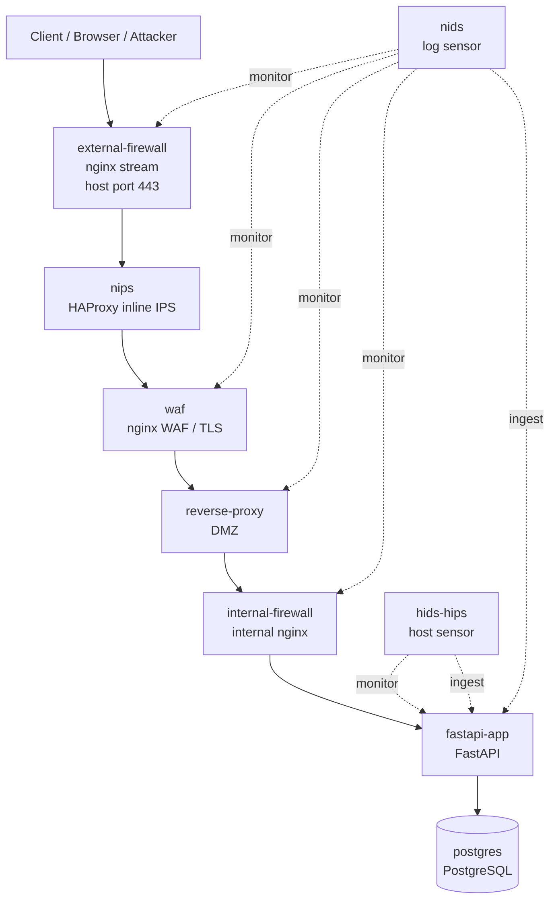

# Security EC Base

EC / Marketplace 系サービスを題材に、外部公開入口、DMZ、Application 層、Database 層、監視レイヤーを 1 台の Linux VM 上で擬似的に分離して検証するための Docker Compose 構成です。

> 実装状況: 2026-07-24 時点。現行仕様の正本は `docker-compose.yml`、各サービス設定、`fastapi/app/main.py`、`postgres/init/001_products.sql` です。本文はそれらに合わせています。

このリポジトリで再現したい主題は「コンテナ化」ではなく、次の設計判断を説明・検証できるようにすることです。

- 外部から直接到達できる入口をどこに限定するか
- 外周、DMZ、内部境界、アプリ、DB の責務をどう分けるか
- NIPS / WAF / NIDS / HIDS/HIPS をどこに置き、何を検知・遮断するか
- 認証情報や個人情報を DB にどう保存するか

## 現在の構成

外部公開されるホストポートは`external-firewall`のHTTPS用`443`だけです。HTTP用`80`は公開せず、後段の`nips`、`waf`、`reverse-proxy`、`internal-firewall`、`fastapi-app`、`postgres`はDocker内部ネットワーク上で直列に中継されます。

```text
Client
  -> external-firewall
  -> nips
  -> waf
  -> reverse-proxy
  -> internal-firewall
  -> fastapi-app
  -> postgres
```

監視センサーは通信本線ではなく横から観測します。

```text
nids      -> external-firewall / waf / reverse-proxy / internal-firewall のログ監視
hids-hips -> fastapi/app の改ざん検知と FastAPI ヘルスチェック
```

## 構成図



より詳細な現在構成は [CURRENT_ARCHITECTURE.md](./CURRENT_ARCHITECTURE.md) にまとめています。

## 主要コンポーネント

| コンポーネント | 実装 | 役割 |
| --- | --- | --- |
| `external-firewall` | `nginx stream` | ホストにHTTPS用`443`を公開する唯一の入口。TLS通信を`nips`に転送する |
| `nips` | `HAProxy` | inline IPS。接続数、リクエストレート、TLS ClientHello 異常を早い段階で遮断する |
| `waf` | `nginx` | TLSを終端するWAF。危険なUser-Agent、path/query、不要メソッド、未許可ルートを遮断する |
| `reverse-proxy` | `nginx` | DMZ 相当の中継点。後段の internal firewall にだけ流す |
| `internal-firewall` | `nginx` | 内部境界。`reverse-proxy` の固定 IP からの通信だけを受け、`/api/` だけ FastAPI に流す |
| `fastapi-app` | FastAPI | 商品 API、認証 API、出品者プロフィール API、監査・監視 API を提供する |
| `postgres` | PostgreSQL 16 | 商品、ユーザー、refresh token、出品者プロフィール、監査イベントを保存する |
| `nids` | Python sensor | 境界ログを監視し、アラートを `logs/nids/alerts.log` と `audit_events` に送る |
| `hids-hips` | Python sensor | FastAPI ソースの改ざん検知と内部ヘルスチェックを行い、`logs/hids/alerts.log` と `audit_events` に送る |

## ネットワーク分離

Compose では次の Docker network で境界を分けています。

| Network | 主な所属 | 意味 |
| --- | --- | --- |
| `public_net` | `external-firewall` | ホスト公開入口 |
| `edge_net` | `external-firewall`, `nips`, `waf`, `reverse-proxy`, `nids` | 外周から DMZ までの中継 |
| `app_net` | `reverse-proxy`, `internal-firewall`, `nids` | DMZ と内部境界 |
| `api_net` | `internal-firewall`, `fastapi-app`, `nids`, `hids-hips` | 内部 API 層 |
| `db_net` | `fastapi-app`, `postgres` | DB 層 |

`edge_net`, `app_net`, `api_net`, `db_net` は `internal: true` です。外部から直接到達させる設計ではありません。

## API 実装

現在の FastAPI は次の API を持ちます。

| 種別 | エンドポイント |
| --- | --- |
| ヘルス / 情報 | `GET /health`, `GET /api/health`, `GET /api/info` |
| 商品 | `GET /api/products`, `POST /api/products`, `GET /api/product?sku=...`, `POST /api/product/stock` |
| 認証 | `POST /api/auth/register`, `POST /api/auth/login`, `POST /api/auth/refresh`, `POST /api/auth/logout`, `GET /api/auth/me`, `GET /api/auth/audit-events` |
| 出品者プロフィール | `POST /api/seller/profile`, `GET /api/seller/profile` |
| 監査 / 監視 | `GET /api/security/audit-events`, `GET /api/security/monitoring/summary` |
| センサー連携 | `POST /api/internal/security-events` |

`/api/internal/security-events` は `SECURITY_SENSOR_TOKEN` で保護された内部センサー向け API です。WAF の公開許可ルートには含めていません。

## DB 実装

PostgreSQL 初期化 SQL は [`postgres/init/001_products.sql`](./postgres/init/001_products.sql) です。

現在の主なテーブル:

- `products`
- `users`
- `refresh_tokens`
- `seller_profiles`
- `audit_events`

認証・暗号化の方針:

- password は `PBKDF2-HMAC-SHA-256` で hash 保存する
- email、出品者連絡先、payout account token は `AES-256-GCM` で暗号化する
- email / phone の検索には `HMAC-SHA-256` の blind index を使う
- access token は短命 JWT として発行する
- refresh token は平文保存せず、HMAC hash を DB に保存し、refresh 時にローテーションする
- login 失敗回数を記録し、しきい値を超えたアカウントを一時ロックする
- 認証、refresh、logout、出品者プロフィール更新、センサー検知を `audit_events` に記録する

詳細は [postgres/AUTH_CRYPTO_DESIGN.md](./postgres/AUTH_CRYPTO_DESIGN.md) を参照してください。

## 起動

```bash
docker compose up -d --build
```

起動後の確認:

```bash
docker compose ps
curl -k -i https://127.0.0.1/api/health
curl -k -i https://127.0.0.1/api/info
```

外部公開ポートはHTTPS用の`443`だけです。HTTP用の`80`は公開せず、HTTPからHTTPSへのリダイレクトも行いません。開発用の自己署名証明書については、[waf/README.md](./waf/README.md)を参照してください。

停止:

```bash
docker compose down
```

DB データも消して初期化し直す場合:

```bash
docker compose down -v
```

## ログ

主なログ出力先:

- `logs/external-firewall/`
- `logs/waf/`
- `logs/nginx/`
- `logs/internal-firewall/`
- `logs/nids/alerts.log`
- `logs/hids/alerts.log`

`nids` と `hids-hips` はローカルログに加えて、内部 API 経由で `audit_events` にも検知イベントを登録します。登録件数は `GET /api/security/monitoring/summary` の `sensor_counts` で確認できます。

## テスト

テストスクリプトは [`other/test/`](./other/test/) にあります。VM 外部から `192.168.64.4` に対して実行する前提のドキュメントになっていますが、ローカルで確認する場合は対象 IP を `127.0.0.1` に読み替えます。

代表的な実行順:

```bash
python3 other/test/external-firewall/portscan.py 192.168.64.4 --ports 22,80,443,8080,5432
python3 other/test/nips/check_nips.py 192.168.64.4
python3 other/test/waf/check_waf.py 192.168.64.4
python3 other/test/reverse-proxy/check_reverse_proxy.py 192.168.64.4
python3 other/test/fastapi/check_fastapi.py 192.168.64.4
python3 other/test/auth-crypto/check_auth_crypto.py 192.168.64.4
python3 other/test/auth-crypto/check_auth_crypto.py 192.168.64.4 --check-db --compose-dir /home/buchi/WebProgramming-ActiveLearner
```

詳細は [other/test/README.md](./other/test/README.md) を参照してください。

## 補足ドキュメント

- [CURRENT_ARCHITECTURE.md](/home/buchi/WebProgramming-ActiveLearner/CURRENT_ARCHITECTURE.md)
  - 現在の Docker 配置、公開入口、通信本線、未分離の API Gateway を整理
- [external-firewall/README.md](/home/buchi/WebProgramming-ActiveLearner/external-firewall/README.md)
  - external firewall の役割、nftables 補助、比較検証
- [nips/README.md](/home/buchi/WebProgramming-ActiveLearner/nips/README.md)
  - HAProxy inline NIPS の設定と検証
- [waf/README.md](/home/buchi/WebProgramming-ActiveLearner/waf/README.md)
  - WAF の検査内容と許可ルート
- [reverse-proxy/README.md](/home/buchi/WebProgramming-ActiveLearner/reverse-proxy/README.md)
  - DMZ reverse proxy の役割
- [internal-firewall/README.md](/home/buchi/WebProgramming-ActiveLearner/internal-firewall/README.md)
  - 内部境界の制御
- [fastapi/README.md](/home/buchi/WebProgramming-ActiveLearner/fastapi/README.md)
  - FastAPI API と認証・暗号化実装
- [postgres/README.md](/home/buchi/WebProgramming-ActiveLearner/postgres/README.md)
  - PostgreSQL 初期化と権限
- [nids/README.md](/home/buchi/WebProgramming-ActiveLearner/nids/README.md)
  - NIDS 相当のログ監視
- [hids/README.md](/home/buchi/WebProgramming-ActiveLearner/hids/README.md)
  - HIDS/HIPS 相当の改ざん検知とヘルス監視
- [security-monitoring-addition.md](/home/buchi/WebProgramming-ActiveLearner/security-monitoring-addition.md)
  - 監視レイヤー追加時の判断、検証結果、制約

## 現在未分離のもの

- `API Gateway`
  - 現在は `fastapi-app` が API を直接提供している
  - 将来的に認証認可、API versioning、API 単位の rate limit を独立させる候補
- 本番向けの秘密情報管理
  - Compose 内の鍵とトークンは開発・検証用
  - 本番相当では secrets manager や環境別の鍵管理へ移す必要がある
- 物理的な完全分離
  - 現在は 1 台の Linux VM と Docker Engine 上の擬似分離
  - 別ホスト、VLAN、クラウド security group、host firewall まで含む構成は別途設計が必要

## 今後の拡張候補

- API Gateway を `fastapi-app` から独立させる
- seller と product の関連付けを追加する
- order / order_items / shipment / review を追加する
- payment provider 参照を追加し、カード番号や CVV は保存しない設計を維持する
- 検証スクリプトを一括実行できる形にする
- 開発用暗号鍵と `SECURITY_SENSOR_TOKEN` を secrets manager 相当へ移す
