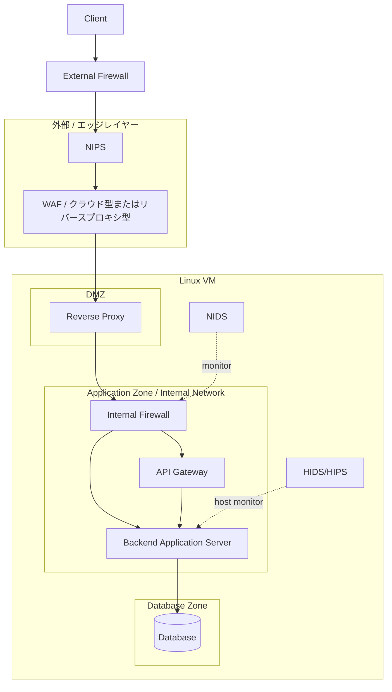

# Security EC Base

このリポジトリは、EC 系サービスを想定した多層防御インフラの検証用ベース構成です。  
Docker Compose を使って、外部公開レイヤー、リバースプロキシ、バックエンド、データストアを段階的に組み立てる前提で整理しています。

現時点では、Step 1 の最小疎通構成を実装済みとしつつ、最終的に目指す理想構成とのあいだに差があります。  
この README ではその差を明示しながら、全体像と今後の進め方を一つの入口にまとめます。

## 基本情報

- 目的
  - 多層防御を前提にしたインフラ構成を段階的に検証する
  - WAF、リバースプロキシ、ホストファイアウォール、監視系の責務分離を整理する
  - 最終的に「どこで何を防ぐか」を説明できる構成にする
- 主な実装技術
  - Docker Compose
  - Nginx
  - Node.js
  - PostgreSQL
  - Redis
  - Rust 製 host firewall
- 現在このリポジトリに存在する主要要素
  - `waf`
  - `nginx` (`reverse-proxy` 用設定)
  - `backend`
  - `host-firewall`
  - `host-firewall-ebpf`
  - `host-firewall-common`
  - `nids-hids`
  - `logs`

## 理想とする全体像

以下は、このリポジトリで最終的に説明対象としたい論理構成です。  
これは「現時点で完全に実装済みの構成」ではなく、「目指す全体像」です。

### この図が示していること

- 外部から内部までを 1 台のサーバや 1 個のコンテナで受けるのではなく、役割ごとに層を分ける
- 防御ポイントを HTTP レイヤーだけでなく、L3/L4、ネットワーク監視、ホスト監視まで分散させる
- 通信の本線に入る要素と、監視として横から見る要素を分けて整理する

## 現在の実装範囲

現時点でこのリポジトリにある実装は、理想構成の一部です。

- `waf`
  - `external-firewall` 後段の HTTP/HTTPS ガード
  - Nginx ベースの簡易ガード
  - 自己署名 TLS により `443` を終端する
- `external-firewall`
  - 外部公開の入口
  - `waf` より前段の TCP 境界
  - 送信元は `Any`、宛先は `80/443` のみを `waf` に通す
- `reverse-proxy`
  - `nginx/` 配下の設定で backend へ中継
- `backend-api`
  - `backend/server.js` の最小 Node.js API
  - `PostgreSQL` / `Redis` の状態を返すヘルスチェック付き
- `postgres`
  - 永続データ保存先
- `redis`
  - 補助データストア
- `host-firewall`
  - Linux VM ホスト境界での L3/L4 制御

未実装または構想段階の要素:

- クラウド上の `External Firewall`
  - 現在は Docker 上の `external-firewall` で代替
  - 本来のクラウド外周、NW 機器、または上位ファイアウォール相当
- `NIPS`
  - 通信を遮断可能な侵入防止レイヤー
- `API Gateway`
  - 現時点では専用コンポーネントなし
- `NIDS`
  - 監視用途の IDS は構成メモ段階
- `HIDS/HIPS`
  - ホスト監視は構成メモ段階

## ステップごとの進め方

このリポジトリは、最初から理想形を一気に作るより、段階ごとに責務を足していく方が整理しやすいです。  
以下は、README 上でも追跡しやすい推奨ステップです。

### Step 1: 最小疎通構成を作る

目的:

- まず通信の本線だけを成立させる
- 各レイヤーの役割を最小限で確認する

構成:

- `external-firewall`
- `waf`
- `reverse-proxy`
- `backend-api`
- `postgres`
- `redis`

実装したこと:

- `external-firewall` が `80/443` を受ける
- `external-firewall` が送信元 `Any` で `80/443` だけを `waf` に転送する
- `waf` が HTTP/HTTPS を検査する
- `reverse-proxy` が `backend-api` へ転送する
- `backend-api` が `PostgreSQL` / `Redis` の接続状態を返す
- `GET /health`
  - WAF レイヤーの生存確認
- `GET /api/health`
  - WAF / reverse proxy / backend を通した集約ヘルスチェック
- `GET /api/info`
  - 現在の構成情報を返す

### Step 2: External Firewall を入れる

目的:

- `waf` より前段に、外周の L4 境界を置く
- 送信元 `Any` のまま、宛先を `80/443` に限定する

追加要素:

- `external-firewall`

確認したいこと:

- Mac からは `80/443` に到達できる
- `80/443` 以外は FW1 のポリシーで拒否される
- `external-firewall` と `waf` の責務差を説明できる

### Step 3: ホスト境界の防御を入れる

目的:

- コンテナ到達前に、Linux VM ホストで不要ポートを落とす

追加要素:

- `host-firewall`

確認したいこと:

- 公開対象ポートだけを許可できる
- 非公開ポートへは到達できない
- Docker の公開設定と host firewall の責務差を説明できる

### Step 4: WAF レイヤーを強化する

目的:

- L7 での簡易防御を強化する

追加・改善候補:

- メソッド制限
- 不正パス拒否
- 危険な User-Agent の拒否
- 将来的な ModSecurity / CRS 導入

確認したいこと:

- 明らかな不正リクエストが WAF で止まる
- 正常トラフィックは `reverse-proxy` に流れる

### Step 5: ネットワーク監視レイヤーを加える

目的:

- 通信を通す / 落とすだけでなく、観測できる状態を作る

追加候補:

- `NIDS`
- `NIPS`

確認したいこと:

- 監視対象区間をどこに置くか説明できる
- 通信の本線と監視の責務を分離できる

### Step 6: ホスト監視を加える

目的:

- アプリや通信だけでなく、ホスト自体の異常兆候を見られるようにする

追加候補:

- `HIDS/HIPS`
- ログ集約
- アラート設計

確認したいこと:

- ファイル変更、認証イベント、異常プロセスなどを監視対象として整理できる

### Step 7: 理想構成との差分を埋める

目的:

- 現在の実装を、冒頭の理想構成へ近づける

検討項目:

- `API Gateway` を独立させるか
- `External Firewall` をどのレイヤーで表現するか
- `NIPS` を実装に含めるか、論理構成としてのみ扱うか
- TLS 終端位置を WAF に置くか別レイヤーに分けるか

## ディレクトリ対応

- [external-firewall](/home/buchi/infra/external-firewall)
  - `waf` の前段に置く TCP firewall
- [waf](/home/buchi/infra/waf)
  - 外部公開の入口
- [nginx](/home/buchi/infra/nginx)
  - reverse proxy 設定
- [backend](/home/buchi/infra/backend)
  - backend API
  - `GET /health`, `GET /api/health`, `GET /api/info`
- [host-firewall](/home/buchi/infra/host-firewall)
  - ホストファイアウォール実装
- [nids-hids](/home/buchi/infra/nids-hids)
  - NIDS/HIDS の構成メモ
- [logs](/home/buchi/infra/logs)
  - 各レイヤーのログ保存先

## README を今後更新する観点

この README は、単なるセットアップ手順ではなく、構成の説明責任を持つ文書として更新していく前提です。  
更新時は次の観点を崩さない方が整理しやすくなります。

- 理想構成と現状構成を混ぜない
- 実装済みの要素と構想段階の要素を分ける
- 各ステップで「何を追加したか」と「何が確認できるようになったか」を残す
- 個別実装の詳細は各ディレクトリ配下の README に逃がし、ルート README は入口に徹する
