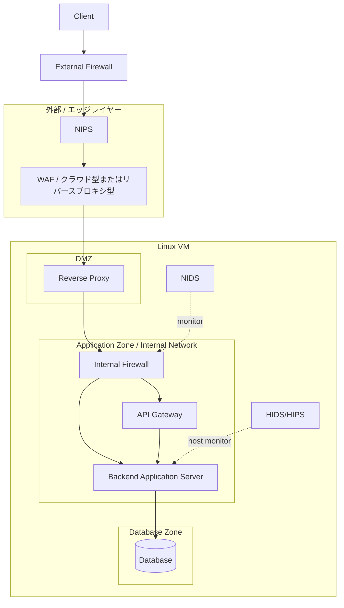

# Security EC Base

このリポジトリは、EC 系サービスを想定した三層構成インフラの検証用ベースです。  
Docker Compose を使って、公開用の DMZ、非公開の Application 層、Database 層を分離して確認できるようにしています。

## 目的

- DMZ / Application / Database の責務分離を確認する
- reverse proxy と internal firewall の役割差を整理する
- 「どこまでを外に見せて、どこからを閉じるか」を説明できる構成にする

## 使用技術

- Docker Compose
- Nginx
- Python / FastAPI
- PostgreSQL

## 補足ドキュメント

- [CURRENT_ARCHITECTURE.md](/home/buchi/WebProgramming-ActiveLearner/CURRENT_ARCHITECTURE.md)
  - Linux VM の入口、Docker 1 から Docker 7 までの現在構成、および未実装の想定レイヤーを Mermaid で整理した図
  - 外部公開されているのはどこか、`external-firewall` から `nips` / `waf` にどう受け渡すか、本来の別サーバ構成とどこまで噛み合っているかも説明
- [postgres/AUTH_CRYPTO_DESIGN.md](/home/buchi/WebProgramming-ActiveLearner/postgres/AUTH_CRYPTO_DESIGN.md)
  - CRYPTREC 暗号リストを参考にした password hash、個人情報暗号化、HMAC blind index、JWT、Marketplace 向け保存情報の設計メモ
- [nids/README.md](/home/buchi/WebProgramming-ActiveLearner/nids/README.md)
  - `audit_events` を使った NIDS 相当の認証異常検知の整理
- [hids/README.md](/home/buchi/WebProgramming-ActiveLearner/hids/README.md)
  - `fastapi-app` ホスト相当で見る HIDS/HIPS シグナルの整理

## 最終的に目指す構成



## この構成をどう読むか

この図は、Docker コンテナの並びそのものではなく、本来は別サーバーまたは別ネットワークに分離されるべき防御層と業務層の責務を表しています。

今回の前提は次の通りです。

- 本来は `DMZ`, `Application`, `Database` は別サーバーで構築する
- ただし、物理的に複数サーバーを用意しづらいため、1 台の VM 上で Docker を使って擬似的に分離する
- したがって Docker は本番代替ではなく、サーバー分離と安全な通信経路を学習・検証するための再現手段として使う

言い換えると、今回 Docker で再現したいのは「コンテナ化」そのものではなく、次のような設計上の意味です。

- 外部から直接触れてよい層はどこか
- どの層からどの層へ通信してよいか
- どこで通信を中継し、どこで検査し、どこで監視するか

## 各要素の意味

- `Client`
  - 利用者やフロントエンド相当
  - システム外部からアクセスしてくる主体
- `FW1 / External Firewall`
  - 最初の外周境界
  - `80/443` など必要最小限の到達性だけを許可する層
  - 本来はクラウド firewall、セキュリティグループ、NW 機器、host firewall などが担う
- `NIPS`
  - 通信を検査し、不正トラフィックを遮断できる侵入防止層
  - 単なる観測ではなく、通信本線上で止める役割を持つ
- `WAF`
  - HTTP/HTTPS のようなアプリケーション層通信を検査する
  - SQLi, XSS, 不審なパス、危険な User-Agent などを早い段階で落とす
  - クラウド型でも reverse proxy 型でもよい
- `RP / Reverse Proxy`
  - Linux VM 内の DMZ に置く公開用サーバ
  - 外部から来た正当なリクエストを内部層へ中継する
  - TLS 終端、ルーティング、ヘッダ付与、負荷分散の入口になりやすい
- `FW2 / Internal Firewall`
  - DMZ と Application Zone の境界
  - Reverse Proxy を通過したあとでも、内部アプリへ行ける通信をさらに限定する
  - 「外に見せる層」と「業務処理を持つ層」を分離するための重要な境界
- `API Gateway`
  - API 群の入口
  - 認証認可、レート制限、API 単位のルーティング、バージョン管理などを担う候補
  - Backend 本体と責務を分けるために独立させる価値がある
- `Back / Backend Application Server`
  - 実際の業務ロジックを持つアプリケーション本体
  - 外部から直接触れさせず、内部経路だけで到達させる
- `DB / Database`
  - 永続データを保持する最深部
  - 原則として FastAPI からのみ接続される
- `NIDS`
  - 通信を監視する IDS
  - 本線上で転送を担うのではなく、横から観測して異常を検知する
- `HIDS / HIPS`
  - ホストやアプリサーバー内部の監視・保護
  - ファイル改ざん、異常プロセス、認証イベントなどを見る

## なぜこの順番なのか

この構成は、外側から内側へ進むほど信頼度を上げ、到達可能性を絞っていく考え方です。

1. `FW1`
   - まず不要なポートや到達性を絞る
2. `NIPS`
   - 本線上で不正通信を落とす
3. `WAF`
   - HTTP/HTTPS レベルの不正を落とす
4. `Reverse Proxy`
   - 公開サーバとして内部への正規入口になる
5. `FW2`
   - DMZ と内部アプリ層を切り分ける
6. `API Gateway / Backend`
   - 業務処理を行う
7. `Database`
   - 最も守るべきデータを保持する

この流れにより、ある 1 層が破られても、次の層で追加の制限や検査がかかる多層防御になります。

## Docker 上での対応づけ

今回の Docker 構成は、この最終図をそのまま完全再現するものではなく、段階的に近づけるためのものです。

現時点での主な対応は次の通りです。

- `external-firewall` コンテナ
  - `FW1 / External Firewall`
  - 外周の L4 gateway を擬似的に再現
- `nips` コンテナ
  - `NIPS`
  - inline proxy として本線上で遮断を行う
- `waf` コンテナ
  - `WAF`
  - TLS 終端と Web 向け詳細検査を行う
- `reverse-proxy` コンテナ
  - `RP / Reverse Proxy`
  - DMZ の公開サーバを擬似的に再現
- `internal-firewall` コンテナ
  - `FW2 / Internal Firewall`
  - `reverse-proxy` の後段で `/api/` だけを `fastapi-app` に流す
- `fastapi-app` コンテナ
  - `Backend Application`
  - 商品 API、認証 API、refresh token、監査イベント API、出品者プロフィール API、PostgreSQL ヘルスチェックを返す
- `postgres` コンテナ
  - `DB / Database`
  - 商品、認証、refresh token、出品者プロフィール、監査イベントのデータ層を擬似的に分離

まだ独立していない要素は、今後必要に応じて分離します。

- `API Gateway`
  - `fastapi-app` から独立させる候補
- `NIDS`, `HIDS/HIPS`
  - 通信本線ではなく監視レイヤーとして追加する候補

## 報告書で説明すべき要点

- Docker を使う理由は、単一 VM 上で複数サーバー構成を擬似再現するためである
- 再現したい本質はコンテナ技術ではなく、信頼境界、公開範囲、通信経路、責務分離である
- 図にある各要素は、単なるソフトウェア名ではなく「どこで何を防ぐか」を示す防御ポイントである
- 特に `DMZ`, `Application Zone`, `Data Zone` を分けることで、侵入されても横移動しにくい構成を目指している
- `NIDS` と `HIDS/HIPS` は通信本線ではなく監視・検知の層として整理する

### 各層の役割

- `external-firewall`
  - ホストに `80/443` を公開する唯一の入口
  - 外周の L4 gateway として `nips` にだけ TCP を流す
- `nips`
  - `external-firewall` と `reverse-proxy` の間に置く inline NIPS
  - source IP ごとの接続レートや TLS handshake 異常を見て広く遮断する
- `waf`
  - `nips` と `reverse-proxy` の間に置く Web Application Firewall
  - HTTP メソッド、危険 UA、危険 path/query などを詳細に検査して止める
- `reverse-proxy`
  - DMZ を模した公開サーバ
  - `waf` の後段で受ける
  - `internal-firewall` コンテナにだけ中継する
- `internal-firewall`
  - 外部公開しない内部境界
  - `/api/` だけを `fastapi-app` に流す
- `fastapi-app`
  - 商品 API、認証 API、JWT、出品者プロフィール API、PostgreSQL 疎通確認を返す
- `postgres`
  - データ保存先
  - `fastapi-app` からだけ参照される前提

## 現在の実装範囲

- `external-firewall/`
  - host で `80/443` を受ける唯一の入口
  - `nginx stream` により `nips` に TCP 転送する
  - host 側では必要に応じて `nftables` による packet filtering を補助適用できる
- `nips/`
  - inline NIPS の設定
  - `HAProxy` により rate 制御と TLS handshake 検査を行う
- `waf/`
  - inline WAF の設定
  - Web アプリケーション向けの HTTP/HTTPS 詳細検査を行う
- `reverse-proxy/`
  - DMZ に置く reverse proxy の設定
- `internal-firewall/`
  - Internal Firewall 相当の nginx と Dockerfile
- `fastapi/`
  - FastAPI の API 実装
  - 商品 API、認証 API、JWT、refresh token、監査イベント API、出品者プロフィール API を含む
- `postgres/`
  - PostgreSQL の初期化 SQL、認証・暗号化設計メモ
  - `products`, `users`, `refresh_tokens`, `seller_profiles`, `audit_events` を管理する
- `logs/`
  - external firewall / reverse proxy / internal firewall / postgres のログ保存先

## 現在再現している段階

最終構成のすべてがまだ入っているわけではありません。  
現時点で Docker 上に再現している本線は次の通りです。

```text
Client
  -> External Firewall
  -> NIPS
  -> WAF
  -> Reverse Proxy
  -> Internal Firewall
  -> FastAPI
  -> Database
```

つまり、最終図のうち現在主に再現できているのは次の要素です。

- `FW1 / External Firewall`
- `NIPS`
- `WAF`
- `RP / Reverse Proxy`
- `FW2 / Internal Firewall`
- `Back / Backend Application Server`
- `DB / Database`

## External Firewall の実装方針

今回の `External Firewall` は、純粋に 1 つの packet filtering 機構だけで作っているわけではありません。  
次の 2 層で実装しています。

- Docker 上の主実装
  - `external-firewall` コンテナが `80/443` だけを受ける
  - `nginx stream` で `reverse-proxy` に TCP 転送する
- host 側の補助実装
  - `nftables` で host の `input` chain に許可ポートを入れる

つまり今回の段階では、External Firewall は「L4 gateway による入口分離」と「必要に応じた packet filtering 補助」の組み合わせとして実装しています。

今後、独立レイヤーとして追加・分離する対象は次の通りです。

- `API Gateway`
- `NIDS` の独立センサー化
- `HIDS/HIPS` の独立監視基盤化

## 現時点で未独立の扱い

現行 Compose の直列構成には、`nips` と `waf` はすでに本線として入っています。  
まだ独立コンテナとして分離していないのは次です。

- `API Gateway`
  - 現在は `fastapi-app` 内で API を直接提供している
  - 将来的に認証認可、API versioning、API 単位の rate limit を分離する候補
- `NIDS`
  - 現段階では `audit_events` と `/api/security/monitoring/summary` で認証異常を検知する
  - 将来的には通信本線ではなく、横から観測する独立監視レイヤーとして追加する候補
- `HIDS/HIPS`
  - 現段階では `fastapi-app` のログインロック、refresh token 失効、監査イベントを保護シグナルとして扱う
  - 将来的にはホスト監視・保護として独立させる候補

## 起動

```bash
docker compose up -d --build
```

## 確認ポイント

- `GET /health`
  - reverse proxy の生存確認
- `GET /api/health`
  - reverse proxy -> internal-firewall -> fastapi-app -> postgres の疎通確認
- `GET /api/info`
  - 現在の構成情報を返す
- `POST /api/auth/register`
  - seller/customer ユーザー登録
- `POST /api/auth/login`
  - JWT 発行
- `POST /api/auth/refresh`
  - refresh token をローテーションし、新しい access token を発行
- `POST /api/auth/logout`
  - refresh token を失効
- `GET /api/auth/me`
  - Bearer token によるユーザー確認
- `GET /api/auth/audit-events`
  - Bearer token に紐づく本人の監査イベント確認
- `POST /api/seller/profile`
  - 出品者プロフィール作成・更新
- `GET /api/security/audit-events`
  - admin / support 向けの監査イベント確認
- `GET /api/security/monitoring/summary`
  - admin / support 向けの NIDS/HIDS 相当シグナル集計

```bash
curl -i http://127.0.0.1/health
curl -i http://127.0.0.1/api/health
curl -i http://127.0.0.1/api/info
curl -k -i https://127.0.0.1/api/health
```

## 今回の変更対応

今回追加した内容と、詳細を読む場所は次の通りです。

| 変更 | 実装 | README / 設計メモ |
| --- | --- | --- |
| refresh token 発行・ローテーション・logout 失効 | `fastapi/app/main.py`, `postgres/init/001_products.sql` | [fastapi/README.md](/home/buchi/WebProgramming-ActiveLearner/fastapi/README.md), [postgres/AUTH_CRYPTO_DESIGN.md](/home/buchi/WebProgramming-ActiveLearner/postgres/AUTH_CRYPTO_DESIGN.md) |
| login attempt / account lockout | `fastapi/app/main.py`, `users.failed_login_count`, `users.locked_until` | [fastapi/README.md](/home/buchi/WebProgramming-ActiveLearner/fastapi/README.md), [postgres/AUTH_CRYPTO_DESIGN.md](/home/buchi/WebProgramming-ActiveLearner/postgres/AUTH_CRYPTO_DESIGN.md) |
| `audit_events` の活用 | `audit_events.severity`, `audit_events.details`, 認証イベント保存 | [fastapi/README.md](/home/buchi/WebProgramming-ActiveLearner/fastapi/README.md), [postgres/AUTH_CRYPTO_DESIGN.md](/home/buchi/WebProgramming-ActiveLearner/postgres/AUTH_CRYPTO_DESIGN.md) |
| NIDS 相当の検知 | `/api/security/monitoring/summary`, `audit_events` 集計 | [nids/README.md](/home/buchi/WebProgramming-ActiveLearner/nids/README.md) |
| HIDS/HIPS 相当の保護 | アカウントロック、refresh token 失効、監査閲覧 | [hids/README.md](/home/buchi/WebProgramming-ActiveLearner/hids/README.md) |
| WAF 許可ルート追加 | `/api/auth/refresh`, `/api/auth/logout`, audit / security API の許可 | [waf/README.md](/home/buchi/WebProgramming-ActiveLearner/waf/README.md) |
| 検証スクリプト拡張 | refresh rotation、古い token 拒否、audit 確認、DB 平文混入確認 | [other/test/auth-crypto/README.md](/home/buchi/WebProgramming-ActiveLearner/other/test/auth-crypto/README.md) |

`External Firewall` の起動・停止・`nftables` 適用・比較検証の詳細は [external-firewall/README.md](/home/buchi/WebProgramming-ActiveLearner/external-firewall/README.md:1) にまとめています。

現時点での検証結果としては、次を確認しています。

- `external-firewall` 停止時は外部疎通が失われる
- `external-firewall` 復旧後は `80/443` と HTTP/HTTPS 疎通が回復する
- `nftables` 適用後も `80/443` の正常疎通は維持される
- 一方、`input chain` だけでは Docker 公開ポート経路に対する遮断効果を明確には観測できなかった
- `nips` 追加後も正常な HTTP/HTTPS 疎通は維持された
- `waf` 追加後も正常な HTTP/HTTPS 疎通は維持された
- `waf` は危険な User-Agent、XSS / SQLi 風 query、非許可メソッドを `403/405` で遮断した
- 認証 API、JWT、出品者プロフィール API は公開入口経由で正常に動作した
- refresh token の発行、ローテーション、logout による失効を実装対象に追加した
- login attempt / account lockout を実装対象に追加し、失敗・ロック・refresh 失敗を `audit_events` に記録する
- DB 内部検証で、平文 email/password が保存されていないことを確認した
- DB 内部検証で、refresh token が平文保存されていないことを確認できるようにした

詳細な結果と報告書向け総括は [external-firewall/README.md](/home/buchi/WebProgramming-ActiveLearner/external-firewall/README.md:1), [nips/README.md](/home/buchi/WebProgramming-ActiveLearner/nips/README.md:1), [waf/README.md](/home/buchi/WebProgramming-ActiveLearner/waf/README.md:1) を参照してください。

## 設計上の意図

- 公開ポートは `external-firewall` だけに寄せる
- `reverse-proxy` は DMZ の内部サーバとして外周入口の後段に置く
- `internal-firewall`, `fastapi-app`, `postgres` は internal network に閉じる
- Docker 上で外周サーバー、DMZ、内部アプリ層、DB 層を段階的に分離する

## 今後の拡張候補

- API Gateway を `fastapi-app` から独立させる
- NIDS / HIDS を独立した監視基盤へ拡張する
- host / cloud 側の本来の External Firewall を別レイヤーとして補完する
- Marketplace 機能として注文、決済参照、配送、レビュー、監査ログを拡張する
- Compose の開発用暗号鍵を secrets manager 相当へ移す

## 現在地点の引き継ぎメモ

2026-07-10 時点では、単なる三層構成の確認から一歩進み、EC / Marketplace 系バックエンドの基礎まで実装しています。

現在の本線:

```text
Client
  -> external-firewall
  -> nips
  -> waf
  -> reverse-proxy
  -> internal-firewall
  -> fastapi-app
  -> postgres
```

現在実装済みの主な API:

- 商品 API
  - `GET /api/products`
  - `POST /api/products`
  - `GET /api/product?sku=...`
  - `POST /api/product/stock`
- 認証 API
  - `POST /api/auth/register`
  - `POST /api/auth/login`
  - `POST /api/auth/refresh`
  - `POST /api/auth/logout`
  - `GET /api/auth/me`
  - `GET /api/auth/audit-events`
- 出品者プロフィール API
  - `POST /api/seller/profile`
  - `GET /api/seller/profile`
- 監視・監査 API
  - `GET /api/security/audit-events`
  - `GET /api/security/monitoring/summary`

現在の DB:

- `products`
- `users`
- `refresh_tokens`
- `seller_profiles`
- `audit_events`

認証・暗号化の現在方針:

- password は復号可能な暗号化ではなく、`PBKDF2-HMAC-SHA-256` で hash 保存する
- email や出品者連絡先は `AES-256-GCM` で暗号化する
- email / phone の検索には `HMAC-SHA-256` の blind index を使う
- access token は JWT として発行する
- access token は短命、refresh token は DB に HMAC hash として保存し、refresh 時にローテーションする
- login 失敗回数を記録し、一定回数を超えたアカウントを一時ロックする
- カード番号や CVV は DB に保存しない方針
- `audit_events` には登録、ログイン、ログイン失敗、ロック、refresh、logout、出品者プロフィール更新を記録する

検証済み:

- 外部公開入口から FastAPI / PostgreSQL まで疎通する
- 商品 API の作成・取得・在庫更新が動作する
- seller ユーザー登録が動作する
- email 重複登録は `409` で拒否される
- 誤 password は `401` で拒否される
- login で JWT が発行される
- login で refresh token が発行される
- refresh token は再利用できず、新しい refresh token にローテーションされる
- logout で refresh token を失効できる
- Bearer token 付き `/api/auth/me` が動作する
- token なし `/api/auth/me` は `401` になる
- Bearer token 付き `/api/auth/audit-events` で本人の監査イベントを確認できる
- seller profile の作成・取得が動作する
- DB 内部検証で、平文 email/password が保存されていないことを確認済み
- DB 内部検証で、refresh token が平文保存されていないことと、`audit_events` にイベントが残ることを確認できる

認証・暗号化の検証結果は [other/test/README.md](/home/buchi/WebProgramming-ActiveLearner/other/test/README.md) と [other/test/auth-crypto/README.md](/home/buchi/WebProgramming-ActiveLearner/other/test/auth-crypto/README.md) に記録しています。  
暗号化設計の考え方は [postgres/AUTH_CRYPTO_DESIGN.md](/home/buchi/WebProgramming-ActiveLearner/postgres/AUTH_CRYPTO_DESIGN.md) にまとめています。

次に進めるなら、優先度は次の順が自然です。

1. 認証基盤の強化
   - refresh token: 実装済み
   - login attempt / account lockout: 実装済み
   - audit_events 連携: 実装済み
   - password reset: 未実装
   - key rotation: 未実装
2. Marketplace 機能の拡張
   - seller と product の関連付け
   - order / order_items
   - payment provider 参照
   - shipment
   - review
3. 監視・防御レイヤーの追加
   - NIPS: HAProxy inline で実装済み
   - NIDS: `audit_events` と `/api/security/monitoring/summary` で認証異常の検知シグナルを確認
   - HIDS / HIPS: アカウントロック、refresh token 失効、権限付き監査閲覧をアプリホスト相当の保護シグナルとして整理
   - audit_events の活用: 実装済み
4. 本番化に近づける整理
   - Compose environment の開発用鍵を secrets manager 相当へ移す
   - API Gateway を独立させる
   - 検証スクリプトを一括実行できる形にする
