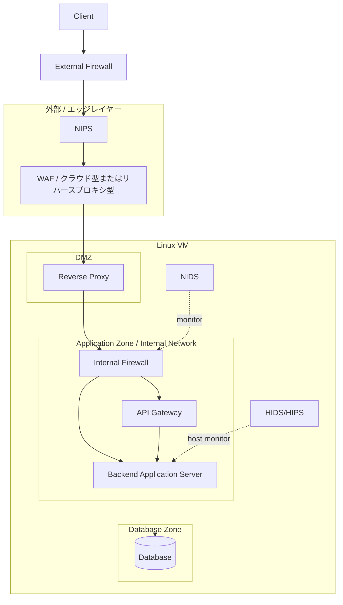

# Security EC Base

このリポジトリは、EC 系サービスを想定した三層構成インフラの検証用ベースです。  
Docker Compose を使って、公開用の DMZ、非公開の Application 層、Database 層を分離して確認できるようにしています。

## 目的

- DMZ / Application / Database の責務分離を確認する
- reverse proxy と internal firewall の役割差を整理する
- 「どこまでを外に見せて、どこからを閉じるか」を説明できる構成にする

## 使用技術

- Docker Compose
- Nginx
- Node.js
- PostgreSQL

## 最終的に目指す構成



## この構成をどう読むか

この図は、Docker コンテナの並びそのものではなく、本来は別サーバーまたは別ネットワークに分離されるべき防御層と業務層の責務を表しています。

今回の前提は次の通りです。

- 本来は `DMZ`, `Application`, `Database` は別サーバーで構築する
- ただし、物理的に複数サーバーを用意しづらいため、1 台の VM 上で Docker を使って擬似的に分離する
- したがって Docker は本番代替ではなく、サーバー分離と安全な通信経路を学習・検証するための再現手段として使う

言い換えると、今回 Docker で再現したいのは「コンテナ化」そのものではなく、次のような設計上の意味です。

- 外部から直接触れてよい層はどこか
- どの層からどの層へ通信してよいか
- どこで通信を中継し、どこで検査し、どこで監視するか

## 各要素の意味

- `Client`
  - 利用者やフロントエンド相当
  - システム外部からアクセスしてくる主体
- `FW1 / External Firewall`
  - 最初の外周境界
  - `80/443` など必要最小限の到達性だけを許可する層
  - 本来はクラウド firewall、セキュリティグループ、NW 機器、host firewall などが担う
- `NIPS`
  - 通信を検査し、不正トラフィックを遮断できる侵入防止層
  - 単なる観測ではなく、通信本線上で止める役割を持つ
- `WAF`
  - HTTP/HTTPS のようなアプリケーション層通信を検査する
  - SQLi, XSS, 不審なパス、危険な User-Agent などを早い段階で落とす
  - クラウド型でも reverse proxy 型でもよい
- `RP / Reverse Proxy`
  - Linux VM 内の DMZ に置く公開用サーバ
  - 外部から来た正当なリクエストを内部層へ中継する
  - TLS 終端、ルーティング、ヘッダ付与、負荷分散の入口になりやすい
- `FW2 / Internal Firewall`
  - DMZ と Application Zone の境界
  - Reverse Proxy を通過したあとでも、内部アプリへ行ける通信をさらに限定する
  - 「外に見せる層」と「業務処理を持つ層」を分離するための重要な境界
- `API Gateway`
  - API 群の入口
  - 認証認可、レート制限、API 単位のルーティング、バージョン管理などを担う候補
  - Backend 本体と責務を分けるために独立させる価値がある
- `Back / Backend Application Server`
  - 実際の業務ロジックを持つアプリケーション本体
  - 外部から直接触れさせず、内部経路だけで到達させる
- `DB / Database`
  - 永続データを保持する最深部
  - 原則として backend からのみ接続される
- `NIDS`
  - 通信を監視する IDS
  - 本線上で転送を担うのではなく、横から観測して異常を検知する
- `HIDS / HIPS`
  - ホストやアプリサーバー内部の監視・保護
  - ファイル改ざん、異常プロセス、認証イベントなどを見る

## なぜこの順番なのか

この構成は、外側から内側へ進むほど信頼度を上げ、到達可能性を絞っていく考え方です。

1. `FW1`
   - まず不要なポートや到達性を絞る
2. `NIPS`
   - 本線上で不正通信を落とす
3. `WAF`
   - HTTP/HTTPS レベルの不正を落とす
4. `Reverse Proxy`
   - 公開サーバとして内部への正規入口になる
5. `FW2`
   - DMZ と内部アプリ層を切り分ける
6. `API Gateway / Backend`
   - 業務処理を行う
7. `Database`
   - 最も守るべきデータを保持する

この流れにより、ある 1 層が破られても、次の層で追加の制限や検査がかかる多層防御になります。

## Docker 上での対応づけ

今回の Docker 構成は、この最終図をそのまま完全再現するものではなく、段階的に近づけるためのものです。

現時点での主な対応は次の通りです。

- `external-firewall` コンテナ
  - `FW1 / External Firewall`
  - 外周の L4 gateway を擬似的に再現
- `nips` コンテナ
  - `NIPS`
  - inline proxy として本線上で遮断を行う
- `waf` コンテナ
  - `WAF`
  - TLS 終端と Web 向け詳細検査を行う
- `reverse-proxy` コンテナ
  - `RP / Reverse Proxy`
  - DMZ の公開サーバを擬似的に再現
- `application` コンテナ
  - `FW2 + API + Backend` の一部または全体を段階的に再現する層
  - 現時点では内部 nginx を `FW2` 相当として使い、その後段で backend を動かしている
- `postgres` コンテナ
  - `DB / Database`
  - データ層を擬似的に分離

まだ独立していない要素は、今後必要に応じて分離します。

- `WAF`
  - reverse proxy 前段または同層で再導入可能
- `API Gateway`
  - backend から独立させる候補
- `NIDS`, `HIDS/HIPS`
  - 通信本線ではなく監視レイヤーとして追加する候補

## 報告書で説明すべき要点

- Docker を使う理由は、単一 VM 上で複数サーバー構成を擬似再現するためである
- 再現したい本質はコンテナ技術ではなく、信頼境界、公開範囲、通信経路、責務分離である
- 図にある各要素は、単なるソフトウェア名ではなく「どこで何を防ぐか」を示す防御ポイントである
- 特に `DMZ`, `Application Zone`, `Data Zone` を分けることで、侵入されても横移動しにくい構成を目指している
- `NIDS` と `HIDS/HIPS` は通信本線ではなく監視・検知の層として整理する

### 各層の役割

- `external-firewall`
  - ホストに `80/443` を公開する唯一の入口
  - 外周の L4 gateway として `nips` にだけ TCP を流す
- `nips`
  - `external-firewall` と `reverse-proxy` の間に置く inline NIPS
  - source IP ごとの接続レートや TLS handshake 異常を見て広く遮断する
- `waf`
  - `nips` と `reverse-proxy` の間に置く Web Application Firewall
  - HTTP メソッド、危険 UA、危険 path/query などを詳細に検査して止める
- `reverse-proxy`
  - DMZ を模した公開サーバ
  - `waf` の後段で受ける
  - `application` コンテナにだけ中継する
- `application`
  - 外部公開しない内部アプリ層
  - コンテナ内 nginx が Internal Firewall として動く
  - `/api/` だけを backend API に流す
- `postgres`
  - データ保存先
  - `application` からだけ参照される前提

## 現在の実装範囲

- `external-firewall/`
  - host で `80/443` を受ける唯一の入口
  - `nginx stream` により `nips` に TCP 転送する
  - host 側では必要に応じて `nftables` による packet filtering を補助適用できる
- `nips/`
  - inline NIPS の設定
  - `HAProxy` により rate 制御と TLS handshake 検査を行う
- `waf/`
  - inline WAF の設定
  - Web アプリケーション向けの HTTP/HTTPS 詳細検査を行う
- `nginx/`
  - DMZ に置く reverse proxy の設定
- `application/`
  - Internal Firewall 相当の nginx と起動設定
- `backend/`
  - Node.js の最小 API
- `logs/`
  - external firewall / reverse proxy / application / postgres のログ保存先

## 現在再現している段階

最終構成のすべてがまだ入っているわけではありません。  
現時点で Docker 上に再現している本線は次の通りです。

```text
Client
  -> External Firewall
  -> NIPS
  -> WAF
  -> Reverse Proxy
  -> Internal Firewall
  -> Backend
  -> Database
```

つまり、最終図のうち現在主に再現できているのは次の要素です。

- `FW1 / External Firewall`
- `NIPS`
- `WAF`
- `RP / Reverse Proxy`
- `FW2 / Internal Firewall`
- `Back / Backend Application Server`
- `DB / Database`

## External Firewall の実装方針

今回の `External Firewall` は、純粋に 1 つの packet filtering 機構だけで作っているわけではありません。  
次の 2 層で実装しています。

- Docker 上の主実装
  - `external-firewall` コンテナが `80/443` だけを受ける
  - `nginx stream` で `reverse-proxy` に TCP 転送する
- host 側の補助実装
  - `nftables` で host の `input` chain に許可ポートを入れる

つまり今回の段階では、External Firewall は「L4 gateway による入口分離」と「必要に応じた packet filtering 補助」の組み合わせとして実装しています。

今後追加する対象は次の通りです。

- `API Gateway`
- `NIDS`
- `HIDS/HIPS`

## 旧構成の扱い

以下は現行 Compose の直列構成には入っていません。

- `waf/`
  - 現在の inline WAF 設定
  - TLS 終端と Web 向け詳細検査を担う
- `nips/`
  - NIPS の設定と設計メモ
  - L3 から L7 までを総合的に見て遮断する inline 層
- `nids-hids/`
  - 監視系の構成メモ

## 起動

```bash
docker compose up -d --build
```

## 確認ポイント

- `GET /health`
  - reverse proxy の生存確認
- `GET /api/health`
  - reverse proxy -> application -> backend -> postgres の疎通確認
- `GET /api/info`
  - 現在の構成情報を返す

```bash
curl -i http://127.0.0.1/health
curl -i http://127.0.0.1/api/health
curl -i http://127.0.0.1/api/info
curl -k -i https://127.0.0.1/api/health
```

`External Firewall` の起動・停止・`nftables` 適用・比較検証の詳細は [external-firewall/README.md](/home/buchi/WebProgramming-ActiveLearner/external-firewall/README.md:1) にまとめています。

現時点での検証結果としては、次を確認しています。

- `external-firewall` 停止時は外部疎通が失われる
- `external-firewall` 復旧後は `80/443` と HTTP/HTTPS 疎通が回復する
- `nftables` 適用後も `80/443` の正常疎通は維持される
- 一方、`input chain` だけでは Docker 公開ポート経路に対する遮断効果を明確には観測できなかった
- `nips` 追加後も正常な HTTP/HTTPS 疎通は維持された
- `waf` 追加後も正常な HTTP/HTTPS 疎通は維持された
- `waf` は危険な User-Agent、XSS / SQLi 風 query、非許可メソッドを `403/405` で遮断した

詳細な結果と報告書向け総括は [external-firewall/README.md](/home/buchi/WebProgramming-ActiveLearner/external-firewall/README.md:1), [nips/README.md](/home/buchi/WebProgramming-ActiveLearner/nips/README.md:1), [waf/README.md](/home/buchi/WebProgramming-ActiveLearner/waf/README.md:1) を参照してください。

## 設計上の意図

- 公開ポートは `external-firewall` だけに寄せる
- `reverse-proxy` は DMZ の内部サーバとして外周入口の後段に置く
- `application` と `postgres` は internal network に閉じる
- Docker 上で外周サーバー、DMZ、内部アプリ層、DB 層を段階的に分離する

## 今後の拡張候補

- WAF を `external-firewall` と `reverse-proxy` の間または前後に再導入する
- host / cloud 側の本来の External Firewall を別レイヤーとして補完する
- NIDS / HIDS を監視系として追加する
